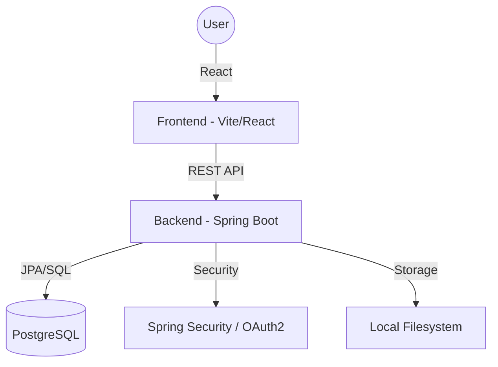

# Global IP Intelligence Platform

A comprehensive full-stack platform for searching, tracking, and analyzing Global Intellectual Property (Patents and Trademarks).

## 🚀 Overview

This platform provides a unified interface to access global IP databases, enabling users to perform advanced searches, monitor application statuses, and visualize trends through a role-based dashboard system.

### Key Features
- **Global IP Search**: Unified search engine for Patents and Trademarks with advanced filtering (jurisdiction, status, year, technology).
- **Role-Based Access Control (RBAC)**: Fine-grained permissions for ADMIN, ANALYST, and USER roles.
- **Interactive Analytics**: Visual trends for IP filings, technology distribution, and family distribution.
- **OAuth2 Integration**: Secure authentication via Google and GitHub.
- **Real-time Monitoring**: System logs (API logs, activity logs) for administrators.
- **Rising Trends**: AI-driven mock data for emerging IP trends analysis.

## 🏗 Architecture



## 🛠 Tech Stack

### Frontend
- **Framework**: React 18 (Vite)
- **Styling**: Tailwind CSS / Vanilla CSS
- **Icons**: Lucide React
- **Charts**: Recharts
- **API Client**: Axios

### Backend
- **Core**: Java 17, Spring Boot 3
- **Security**: Spring Security, JWT, OAuth2
- **Database**: PostgreSQL with Spring Data JPA
- **Mailing**: Spring Boot Starter Mail

## ⚙️ Getting Started

### Prerequisites
- JDK 17+
- Node.js 18+
- PostgreSQL 14+

### Backend Setup
1. Navigate to `backend/project`.
2. Configure `src/main/resources/application.properties`.
3. Run the application:
   ```bash
   mvn spring-boot:run
   ```

### Frontend Setup
1. Navigate to `frontend/frontend-app`.
2. Install dependencies:
   ```bash
   npm install
   ```
3. Run the development server:
   ```bash
   npm start
   ```

## 🔒 Security Configuration

The project uses environment variables for sensitive data. Ensure the following are set:
- `JWT_SECRET`: Base64 encoded signing key.
- `GOOGLE_CLIENT_ID` / `GOOGLE_CLIENT_SECRET`: For Google OAuth.
- `MAIL_PASSWORD`: App-specific password for Gmail integration.

## 📄 License
This project is licensed under the MIT License - see the [LICENSE](LICENSE) file for details.
